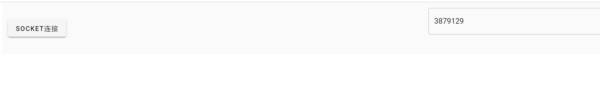

# Vue and Flask SocketIO 简单示例

# Backend后端

### Prerequisites

python3.9 (推荐conda构建一个新的环境)

`pip install -r requirements.txt`

### Version compatibility

socketIO依赖于多个库，要能够正常使用的话，需要正确的安装对应依赖库的版本，当前代码中使用的是中间的那个

详细信息可以参考：https://flask-socketio.readthedocs.io/en/latest/intro.html#version-compatibility

| JavaScript Socket.IO version | Socket.IO protocol revision | Engine.IO protocol revision | Flask-SocketIO version | python-socketio version | python-engineio version |
| ---------------------------- | --------------------------- | --------------------------- | ---------------------- | ----------------------- | ----------------------- |
| 0.9.x                        | 1, 2                        | 1, 2                        | Not supported          | Not supported           | Not supported           |
| **1.x and 2.x**             | **3, 4**                   | **3**                      | **4.x**               | **4.x**                | **3.x**                |
| 3.x and 4.x                  | 5                           | 4                           | 5.x                    | 5.x                     | 4.x                     |

### 运行

进入到backend目录下，运行app.py:

```bash
cd backend
python app.py
```

# Fronted 前端

### Prerequisites

安装yarn

```
conda install yarn
```

### 运行前端

进入到fronted目录下. 运行一下的命令. 然后在浏览器中打开

```bash
cd fronted
yarn install
yarn run serve --port 8111

# http://your_ip:8111
```

注意:若修改了后端的端口，需要在fronted/src/components/HelloWorld.vue中也修改后端的端口

打开前端的界面，在建立了socket连接后，后端会不断的向前端推送一些随机数字显示




注：前后端是分别独立运行

# References

1. https://github.com/iodriller/VueJs-Flask-SocketIO-Example-Templatehttps://github.com/bioudi/Flask-VueJs-SocketI
   做了一些简化
